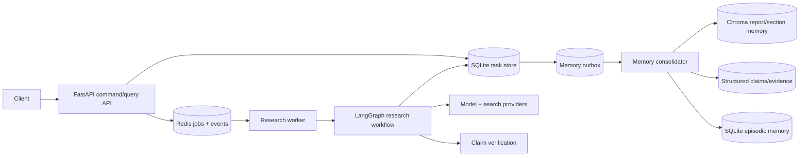

# Deep Research Agent

A recoverable multi-agent research runtime built with LangGraph, FastAPI, Redis,
SQLite and Chroma. The project focuses on two engineering problems that become
painful in long-running research agents: **reliable execution** and **usable
long-term memory**.

> Portfolio status: the core runtime and Memory 3.0 paths are implemented in this
> repository. The latest memory changes are covered by standalone offline smoke
> suites. A previous hybrid local/cloud runtime has recorded E2E evidence, but the
> latest snapshot is **not presented as production-validated**. See
> [Project status](docs/PROJECT_STATUS.md).

## What makes this project interesting

- **Worker-owned LangGraph execution** — the API persists commands and streams
  events; a separate worker owns graph execution and checkpoints.
- **Recoverable task runtime** — Redis Stream jobs, fenced task claims,
  heartbeats, stale-job reclaim and orphan reconciliation.
- **Human-in-the-loop review** — review decisions are persisted before graph
  resume, so API restarts do not strand a task.
- **Evidence-aware report pipeline** — research, draft, claim verification and
  final writer stages remain separate responsibilities.
- **Memory 3.0** — report-section memory, structured Claim/Evidence provenance,
  hybrid retrieval, temporal change candidates and research-episode memory.
- **Durable memory enrichment** — task completion and the memory outbox are
  committed together; enrichment runs outside the user-visible critical path and
  can resume after failure.
- **Offline-first testing** — fake LLM/search/embedding paths and explicit network
  guards keep normal tests away from paid APIs.

## Architecture



The dependency boundary is intentional: `backend/` owns service/runtime concerns;
`deep_research/` owns the research graph and research-domain logic. Shared memory
clients are constructed in `deep_research.memory.runtime`, so the memory layer
never has to import the graph builder just to reach a singleton.

Start with:

- [Architecture overview](architecture/README.md)
- [Memory architecture](architecture/MEMORY.md)
- [Code map](architecture/CODE_MAP.md)
- [Design decisions](docs/DESIGN_DECISIONS.md)

## Research workflow

The exact topology depends on feature flags, but the core stages are:


Historical memory is advisory. It can influence research planning and query
selection, but it is wrapped as untrusted context and does not replace current
search or claim verification.

## Memory 3.0

Memory is split by responsibility instead of treating every old token as one
vector-search bucket.

| Layer | Purpose | Main implementation |
|---|---|---|
| Report / section memory | Preserve long reports and retrieve relevant regions | `deep_research/memory/manager.py`, `sections.py`, `vector_store.py` |
| Structured semantic memory | Entities, Claims, Evidence, Contradictions with provenance | `schemas.py`, `structured_store.py` |
| Hybrid retrieval | Dense + lexical + exact-entity signals | `retrieval.py`, `manager.py` |
| Stage-aware recall | Bounded hints for Brief / Supervisor / Researcher | `stage_retrieval.py` |
| Episodic memory | Observed queries, source domains and tool failures from accepted research lineages | `episodes.py` |
| Temporal memory | Candidate changes + explicit audited review decisions | `temporal.py` |
| Durable consolidation | Retryable at-least-once report/episode enrichment | `backend/runtime/memory_outbox.py`, `backend/memory_worker.py` |

The current roadmap deliberately stops short of automatic graph-based inference.
Advanced knowledge-graph / A-MEM style association is listed as future work, not
silently advertised as implemented.

## Repository map

```text
.
├── backend/                    # FastAPI, persistence, Redis runtime, workers
│   ├── routes/                 # command/query/event API
│   ├── runtime/                # queue, claims, runner, SSE, memory outbox
│   └── db/                     # SQLAlchemy models + repository
├── deep_research/              # research engine
│   ├── agents/                 # supervisor/research/draft/evaluator/red-team
│   ├── memory/                 # Memory 3.0 subsystem
│   ├── verification/           # claim extraction + verification
│   └── prompts/                # prompt contracts
├── architecture/               # diagrams and code-oriented system docs
├── docs/                       # decisions, status, experiments, deployment notes
├── examples/                   # API/demo walkthroughs
├── migrations/                 # Alembic task/outbox/temporal schema
├── scripts/                    # operations, backfill, experiments, repo checks
└── tests/                      # unit/integration-style offline tests + smoke suites
```

This snapshot does **not** include a frontend source tree. The API/SSE contract is
implemented and can be consumed by any UI client; the Docker Compose file therefore
only declares services that exist in this repository.

## Quick start: inspect and test offline

Python 3.12 is the target runtime.

```bash
python -m venv .venv
source .venv/bin/activate
python -m pip install -e ".[dev]"

cp config.server.example.yml config.yml
export APP_ENV=test
export ALLOW_LIVE_EXTERNAL_APIS=false
export LLM_PROVIDER=fake
export SEARCH_PROVIDER=fake
export CHECKPOINTER_BACKEND=sqlite
```

Repository contract + static checks:

```bash
python scripts/check_repo_hygiene.py
ruff check deep_research backend tests scripts/check_repo_hygiene.py
python -m compileall -q deep_research backend scripts tests
```

Full offline test suite after dependencies are installed:

```bash
pytest -q -m "not live"
```

The four standalone memory smoke suites are also useful when reviewing a snapshot:

```bash
PYTHONPATH=. python tests/offline_phase123_smoke.py
PYTHONPATH=. python tests/offline_memory3_smoke.py
PYTHONPATH=. python tests/offline_memory56_smoke.py
PYTHONPATH=. python tests/offline_memory7_temporal_smoke.py
```

## Runtime modes

### Fake/offline mode

Use `config.server.example.yml` plus the fake provider environment variables.
This is the safest mode for CI and code review.

### Hybrid model mode

`config.hybrid.example.yml` shows the previously exercised split between an
OpenAI-compatible local vLLM endpoint and a cloud OpenAI-compatible provider. It
contains no real credentials. Provider keys belong in local secrets/environment
configuration and must never be committed.

### Service runtime

```bash
alembic upgrade head
python -m backend.worker
uvicorn backend.main:app --host 0.0.0.0 --port 8000
```

For dedicated durable memory processing:

```bash
export DR_MEMORY_OUTBOX_POLL_ON_WORKER=off
python -m backend.memory_worker
```

Redis remains required for the command/event runtime. The default Compose topology
contains `backend`, `worker`, `memory-worker` and `redis` only.

## Demo walkthrough

See [examples/demo_run.md](examples/demo_run.md) for the API flow from task
submission through HITL, final report persistence and durable memory enrichment.

## Evidence and limitations

- [E2E evidence](docs/E2E_EVIDENCE.md) records a previous hybrid runtime run.
- [Project status](docs/PROJECT_STATUS.md) distinguishes code-complete, offline-
  tested and runtime-validated claims.
- [Testing](docs/TESTING.md) explains what each test layer proves.
- [Roadmap](docs/ROADMAP.md) lists production hardening and the intentionally
  unimplemented advanced knowledge-graph experiment.

Important current limitations include: no tenant isolation for shared memory,
no claim that temporal candidates automatically determine truth, and no claim
that the latest Memory 3.0 snapshot has been re-run through a full external-provider
E2E environment.

## Interview notes

If you are reviewing this repository for a system-design discussion, the shortest
path is:

1. `architecture/README.md` — execution ownership and failure recovery.
2. `architecture/MEMORY.md` — why memory is split into semantic, episodic and
   temporal responsibilities.
3. `docs/DESIGN_DECISIONS.md` — trade-offs and rejected alternatives.
4. `docs/INTERVIEW_GUIDE.zh-CN.md` — a Chinese speaking outline for the project.

## License

No open-source license is declared in this snapshot. Add an appropriate license
before accepting external reuse or contributions.
