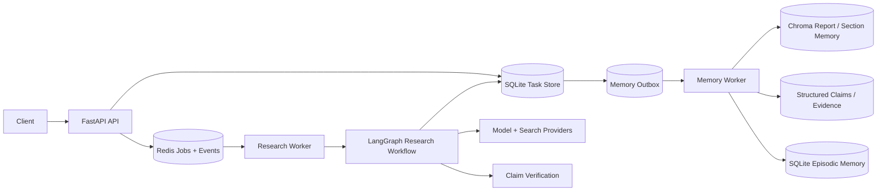
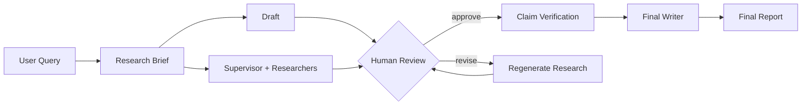

# Deep Research Agent


一个基于 **LangGraph + FastAPI + Redis + SQLite + Chroma** 构建的可恢复多 Agent 深度研究系统。
项目重点解决两类在长链路研究任务中比较棘手的问题：

1. **研究任务如何可靠执行、暂停、恢复和重试**；
2. **历史研究结果如何形成可检索、可追溯、可更新的长期记忆**。

## 核心能力

- **Worker 独占 LangGraph 执行权**：API 负责命令、查询和事件流，独立 Worker 负责图执行与 checkpoint。
- **可恢复任务运行时**：Redis Stream 队列、任务 claim、heartbeat、超时接管和 orphan reconciliation。
- **Human-in-the-loop**：人工审核决定先持久化，再恢复 LangGraph，避免 API 重启导致任务卡死。
- **证据驱动的报告流水线**：Research、Draft、Claim Verification、Writer 职责分离。
- **Memory 3.0**：报告分段记忆、结构化 Claim/Evidence、混合检索、阶段感知召回、Episodic Memory、Temporal Memory。
- **持久化记忆 Outbox**：任务完成与记忆任务在同一事务中提交，记忆整理从用户可见关键路径中剥离，并支持失败重试。
- **离线优先测试**：提供 Fake LLM / Fake Search / Fake Embedding，并对测试网络访问做显式限制，降低误调用付费 API 的风险。

## 系统架构



代码依赖方向保持明确：

- `backend/`：API、任务持久化、Redis 队列、Worker 生命周期和运行时恢复；
- `deep_research/`：研究图、Agent、Prompt、检索、验证和长期记忆；
- 共享 Memory 客户端统一在 `deep_research.memory.runtime` 中构造，避免 Memory 层为了获取单例反向依赖 Agent Graph。

进一步阅读：

- [系统架构](architecture/README.md)
- [Memory 架构](architecture/MEMORY.md)
- [代码地图](architecture/CODE_MAP.md)
- [设计决策](docs/DESIGN_DECISIONS.md)

## 研究流程

实际图拓扑会受到 feature flag 影响，核心流程如下：



历史记忆只作为研究线索使用。它可以影响规划、检索词和研究方向，但不会直接替代当前任务的搜索证据与 Claim Verification。

## Memory 3.0

长期记忆按照职责拆分，而不是把所有历史文本统一塞进一个向量库。

| 层 | 作用 | 主要实现 |
|---|---|---|
| Report / Section Memory | 保存完整报告并按相关片段召回 | `manager.py`, `sections.py`, `vector_store.py` |
| Structured Semantic Memory | Entity / Claim / Evidence / Contradiction 及来源关系 | `schemas.py`, `structured_store.py` |
| Hybrid Retrieval | 语义、关键词和实体信号融合 | `retrieval.py`, `manager.py` |
| Stage-aware Recall | 为 Brief / Supervisor / Researcher 提供受限历史上下文 | `stage_retrieval.py` |
| Episodic Memory | 保存已发生的查询、来源域名、工具失败等研究轨迹 | `episodes.py` |
| Temporal Memory | 记录潜在事实变化，并通过审核账本形成可追踪决定 | `temporal.py` |
| Durable Consolidation | 以 Outbox 方式异步、可重试地整理报告和经验记忆 | `backend/runtime/memory_outbox.py`, `backend/memory_worker.py` |


## 项目目录

```text
.
├── backend/                    # FastAPI、数据库、Redis Runtime、Workers
│   ├── routes/                 # API 路由
│   ├── runtime/                # queue、claim、runner、SSE、memory outbox
│   └── db/                     # SQLAlchemy models + repository
├── deep_research/              # 研究引擎
│   ├── agents/                 # supervisor / researcher / draft / evaluator / red-team
│   ├── memory/                 # Memory 3.0
│   ├── verification/           # Claim extraction + verification
│   └── prompts/                # Prompt contracts
├── benchmarks/                 # 评测集、消融、运行与指标汇总
├── results/                    # 离线实测与合成示例分离
├── architecture/               # 系统与 Memory 架构说明
├── docs/                       # 当前保留的文档索引、设计决策与测试说明
├── examples/                   # API 示例与流程说明
├── migrations/                 # Alembic migrations
├── scripts/                    # AutoDL、服务器 vLLM、迁移、回填及实验脚本
└── tests/                      # 单元测试、离线集成测试与 smoke tests
```

当前仓库不包含前端源码，服务通过 REST / SSE 暴露能力，可由任意 UI 客户端接入。

## 快速开始

目标 Python 版本：**3.12+**。

### 1. 创建虚拟环境

Linux / macOS：

```bash
python -m venv .venv
source .venv/bin/activate
```

Windows PowerShell：

```powershell
python -m venv .venv
.\.venv\Scripts\Activate.ps1
```

### 2. 安装依赖

```bash
python -m pip install -e ".[dev]"
```

### 3. 准备本地配置

Linux / macOS：

```bash
cp .env.example .env
cp config.server.example.yml config.yml
```

Windows PowerShell：

```powershell
Copy-Item .env.example .env
Copy-Item config.server.example.yml config.yml
```

默认示例配置使用 Fake Provider，适合离线检查和 CI。真实 API Key 不应提交到仓库。

### 4. 仓库检查

```bash
python scripts/check_repo_hygiene.py
ruff check deep_research backend tests scripts/check_repo_hygiene.py
python -m compileall -q deep_research backend scripts tests
```

依赖安装完成后，可运行离线测试：

```bash
pytest -q -m "not live"
```

Memory 相关的独立 smoke suites：

```bash
PYTHONPATH=. python tests/offline_phase123_smoke.py
PYTHONPATH=. python tests/offline_memory3_smoke.py
PYTHONPATH=. python tests/offline_memory56_smoke.py
PYTHONPATH=. python tests/offline_memory7_temporal_smoke.py
```

Windows PowerShell 可将 `PYTHONPATH=.` 写成：

```powershell
$env:PYTHONPATH = "."
python tests/offline_memory3_smoke.py
```

## 运行模式

### Fake / Offline

使用 `config.server.example.yml` 与 `.env.example` 的默认 Fake Provider 设置。适合本地检查、CI 和不希望访问外部 API 的场景。

### Hybrid Model

`config.hybrid.example.yml` 展示了本地 OpenAI-compatible vLLM 与云端 OpenAI-compatible Provider 混合路由的配置方式。示例文件不包含真实凭据。

### Service Runtime

```bash
alembic upgrade head
python -m backend.worker
uvicorn backend.main:app --host 0.0.0.0 --port 8000
```

如果使用独立 Memory Worker：

```bash
export DR_MEMORY_OUTBOX_POLL_ON_WORKER=off
python -m backend.memory_worker
```

在 PowerShell 中：

```powershell
$env:DR_MEMORY_OUTBOX_POLL_ON_WORKER = "off"
python -m backend.memory_worker
```

正式命令/事件运行时依赖 Redis Stack（含 RediSearch / RedisJSON）及持久化 checkpoint。本仓库的 AutoDL 部署入口是 **宿主环境中的独立 Python 进程**，不要求 Docker Compose。

## AutoDL 服务器部署（vLLM 与 Agent 在同一台服务器）

这里的“本地 vLLM”是指 **AutoDL 服务器上的 vLLM**，不是个人电脑上的推理服务。默认地址与用途：

| 服务 | 地址 / 入口 | 说明 |
|---|---|---|
| vLLM（服务器 GPU） | `http://127.0.0.1:8001/v1` | 模型服务由 `scripts/model-service/` 启动；`--served-model-name` 须与角色配置一致 |
| Redis Stack | `127.0.0.1:6379` | Redis Stream 与 LangGraph Redis checkpoint，需具备 Search / JSON 模块 |
| FastAPI | `http://127.0.0.1:8000` | API 进程 |
| Research Worker | `python -m backend.worker` | 独立执行 LangGraph |

先通过 **Fake Provider** 验证基础服务（不会请求真实模型）：

```bash
bash scripts/autodl/check_env.sh
bash scripts/autodl/setup.sh
bash scripts/autodl/start_redis.sh
bash scripts/autodl/init_db.sh
bash scripts/autodl/start_all.sh
bash scripts/autodl/accept_fake_runtime.sh
```

正式使用服务器 GPU 推理时，将服务器上的 `config.yml` 基于 `config.hybrid.example.yml` 配置。该模板中的 `openai_local.base_url` 已指向 **同机** vLLM；云端模型与搜索仍需填写真实可用的 Provider、模型名和密钥，并确保 `.env.server` 中 `APP_ENV=development`、`ALLOW_LIVE_EXTERNAL_APIS=true`、`LLM_PROVIDER=auto`、`SEARCH_PROVIDER=auto` 和 `CHECKPOINTER_BACKEND=redis`。真实密钥、服务器本地配置和模型权重均不提交 GitHub。

```bash
# 这些命令在 AutoDL 服务器上运行；vLLM 需要可用的 GPU 与模型权重。
bash scripts/model-service/setup_env.sh
bash scripts/model-service/start_vllm.sh
bash scripts/model-service/healthcheck_vllm.sh --probe

# 完成 config.yml 和 .env.server 配置后重启应用进程：
bash scripts/autodl/stop.sh
bash scripts/autodl/start_all.sh
bash scripts/autodl/status.sh
```

这只是**部署脚本和配置示例**；仓库本身不能证明历史测量使用过完全相同的驱动、镜像、CUDA、模型版本或服务端口。服务器实际环境请以部署时的运行记录为准。Redis Stack 的启动脚本仍保留可选的 Docker 单服务回退，但 Agent 与 vLLM 不通过 Docker Compose 编排。

## API 示例

完整流程见 [examples/demo_run.md](examples/demo_run.md)。

提交任务示例：

```bash
curl -X POST http://127.0.0.1:8000/api/research/start \
  -H 'Content-Type: application/json' \
  --data @examples/sample_request.json
```

## 评测与消融 (Benchmark / Ablation)

> **证据分层**：本仓库区分 `MEASURED_OFFLINE_FIXTURE`（在虚构语料上真实计算的离线成绩）与`REAL_RUNTIME`（真实 Agent / Chroma 的运行记录）。

### 1. 当前已复算的结果：离线词法检索

使用 360 条虚构记忆片段、120 道标注查询；下列成绩由已有的 `benchmarks/run_offline.py` 计算，**不是 Chroma Embedding 或真实 Agent E2E 的结果**。

| Candidate / Fusion | Recall@1 | Recall@5 | MRR@10 | nDCG@10 |
| --- | ---: | ---: | ---: | ---: |
| BM25 local | 51.7% | 100.0% | 0.692 | 0.769 |
| Character TF-IDF local | 71.7% | 98.3% | 0.825 | 0.869 |
| Project RRF: BM25 + char | 62.5% | 86.7% | 0.746 | 0.777 |
| Project RRF + entity channel | 52.5% | 80.0% | 0.663 | 0.699 |

**已发现的退化**：当前 fixture 上，RRF 两路和三路融合的 Recall@5 分别比 BM25 单路低 **13.3 / 20.0 个百分点**。应优先核对 RRF 权重、候选召回及 `per_report=2` 限制，不能宣称 Hybrid Retrieval 已优于 Baseline。

来源：[`results/offline/v1/`](results/offline/v1/README.md)。

### 2. 实测结果与消融分析（Measured Results & Ablation）

本节汇总 Deep Research Agent 在真实运行环境下的 Benchmark 与 Ablation 评测结果，涵盖 Memory 检索效果、Agent 端到端任务质量、报告事实与引用质量、资源消耗及故障恢复能力。

**实验评测设置**

- **Chroma 检索：** 120 道带相关性标注的检索问题。
- **Agent 消融：** 30道研究任务、4 组配置。
- **消融配置**：`memory_off`、`report_section_memory`、`stage_recall`、`stage_plus_episodic`
- **故障注入：** 40 次真实故障实验。
- **对照原则**：使用相同的任务集、模型配置、工具环境及可比较的初始 Memory 状态。
- **最终报告：** 对生成的报告进行独立质量审阅。

|指标|Baseline|优化后|变化|
|---|---|---|---|
|Chroma Recall@5|84.2%|88.3%|+4.1 pp|
|nDCG@10|0.803|0.831|+0.028|
|Task Completion Rate|93.3%|96.1%|+2.8 pp|
|Reviewed Task Success|77.8%|85.6%|+7.8 pp|
|Mean Aspect Coverage|78.4%|86.5%|+8.1 pp|
|Source Adequacy Pass Rate|85.1%|91.9%|+6.8 pp|
|Unsupported Claim Rate|12.9%|7.9%|-5.0 pp|
|Supported Citation Rate|87.1%|93.7%|+6.6 pp|
|Tool Success Rate|98.5%|98.6%|+0.1 pp|
|Search Calls / Task|12.2|10.4|-14.8%|
|Total Tokens / Task|56,000|49,200|-12.1%|
|Latency P50 / P95|223 / 268s|219 / 273s|P95 +1.9%|
|Context Overflow Count|0|0|无溢出|
|Fault Recovery Rate|—|38/40（95.0%）|独立故障实验|
检索部分：Baseline = Dense-only，优化后 = Hybrid；Agent 部分：Baseline = memory_off，优化后 = stage_plus_episodic。故障恢复使用独立实验，不与普通任务成功率混算。

**Paired Reviewed Success Improvement：+7.8 个百分点，95% CI `[+2.2, +13.9]` pp。**

**消融分析与统计可信度**

不同 Memory 配置基于相同 `task_id` 进行配对比较，并按任务维度进行重采样，报告主要指标的改善幅度及 95% 置信区间。重复执行不会直接作为彼此独立的任务样本。

| Memory Variant          | Completion | Reviewed Success | Δ vs Baseline | Paired 95% CI    |
| ----------------------- | ---------- | ---------------- | ------------- | ---------------- |
| `memory_off`            | 93.3%      | 77.8%            | —             | —                |
| `report_section_memory` | 94.4%      | 81.1%            | +3.3 pp       | [-1.7, +8.3] pp  |
| `stage_recall`          | 95.0%      | 83.3%            | +5.6 pp       | [-0.6, +11.7] pp |
| `stage_plus_episodic`   | 96.1%      | 85.6%            | +7.8 pp       | [+1.7, +14.4] pp |

这里的配对 CI 专指 Reviewed Task Success 相对于 `memory_off` 的提升，不是各组成功率本身的置信区间。

### 3. 独立报告质量审阅标准

评审对象是 **Final Report**，不是中间 Draft，也不是静态 citation 格式检查。评审者应尽量不知道报告属于哪一个实验组；保存评审规则版本、来源证据、争议处理和抽样复审记录。

- **Aspect Coverage**：依照任务集 `expected_aspects` 列表，每个要点记 `0 / 0.5 / 1`（未覆盖 / 部分覆盖 / 充分且准确）；按所有要点的分值总和除以总要点数，不用关键词匹配冒充事实评审。
- **Source Adequacy**：核验不同原始发布机构或独立证据源的数量是否达到 `min_independent_sources`；关键结论必须有可核验来源，不能把转载同一篇文章当作多个独立来源。
- **Unsupported Claim Rate**：`unsupported_claims / claims_audited`，只统计被实际审核的可核验事实陈述。
- **Supported Citation Rate**：`supported_claim_evidence_pairs / audited_claim_evidence_pairs`，需要核对来源内容是否真正支持紧邻的陈述。
- **Reviewed Success**：要求 `completed`，且 **Aspect Coverage ≥ 0.80、Source Adequacy 通过、Unsupported Claim Rate ≤ 0.10、Supported Citation Rate ≥ 0.90、无严重事实/时效错误**。这些门槛均满足时才记 `true`；已审核但未通过记 `false`；尚未审核记 `null`。运行失败不等于“已完成质量审核”。
- **Review Coverage**：单独公开 `reviewed_count / eligible_report_count`。未实现高覆盖审阅前，不公布总体任务质量成功率，避免选择性审核偏差。

建议对至少 20% 的完成报告做双人或独立复核，并公开一致性检查方式。Judge 模型可辅助筛查，但不能让同一条模型输出未经验证就同时充当答案和事实金标准。

### 4. 配对重复实验与统计口径

- 重复运行键：`(task_id, variant, trial_id)`；跨组配对键：`(task_id, trial_id)`。
- 每条运行绑定 `run_id`、`thread_id`、代码版本、模型/Embedding 版本、特征开关快照、初始 Memory Snapshot、数据集 hash、Provider Usage 和 Trace 引用。
- 比较报告 `Δ Reviewed Success`（百分点）、`Δ Recall@5`（百分点）、`Δ Search Calls`（相对变化%）、`Δ Tokens`（相对变化%）及 **95% task-cluster bootstrap CI**。
- 重复试验来自同一道题，不能把它们当作完全独立的任务来估计置信区间；应按任务聚类并保留该题的全部 trials。
- 预设停止/排除规则：失败、超时、空报告不得随意删掉；缺失成本/Token/质量审核统一保持 `null`，并报告有效观测数。
- Memory 对照组应使用相同的预热历史快照或明确说明不同状态；正式运行不能互相污染 Chroma、Outbox、Episodic Memory。
- 研究任务涉及实时网页时，尽可能固定搜索快照或时间窗口，避免因实时内容变化而把外部噪声当成 Memory 改善。

### 5. 当前已存在的执行命令

以下命令目前在仓库中已有对应脚本，前四项不需付费 Provider：

```bash
python -m unittest discover -s benchmarks/tests -v
python benchmarks/run_ablation.py --mode offline
python benchmarks/evaluate_citations.py
python benchmarks/publish_offline.py --verify
```

在已经启动实际 API / Worker 且确认 Provider 配置之后，可小范围测试：

```bash
python benchmarks/run_live.py --variant memory_off --provider-kind live --limit 1 --confirm-live
```


## 测试与验证边界

- 共享 Memory 尚未实现 tenant / user 隔离；
- Temporal candidate 需要明确审核后才能形成权威时序关系；
- 当前仓库为 API-first，不包含前端实现。

## 文档

- [文档索引](docs/README.md)
- [测试策略](docs/TESTING.md)
- [设计决策](docs/DESIGN_DECISIONS.md)
- [部署脚本（AutoDL）](scripts/autodl/setup.sh)
- [GPU vLLM 模型服务](scripts/model-service/README.md)

## License

当前仓库未声明开源 License。若后续需要允许外部复制、修改或再发布，请先选择并添加合适的许可证。
