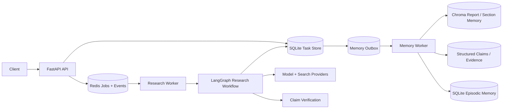
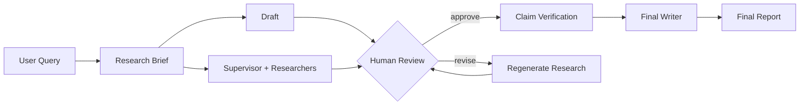

# Deep Research Agent

一个基于 **LangGraph + FastAPI + Redis + SQLite + Chroma** 构建的可恢复多 Agent 深度研究系统。
项目重点解决两类在长链路研究任务中比较棘手的问题：

1. **研究任务如何可靠执行、暂停、恢复和重试**；
2. **历史研究结果如何形成可检索、可追溯、可更新的长期记忆**。

仓库包含研究运行时、Memory 3.0 核心实现、数据库迁移、自动化测试与架构文档。各模块的实现范围和验证证据记录在 [项目状态](docs/PROJECT_STATUS.md)；尚未完成的生产环境验证和多租户能力则单独列入 [Roadmap](docs/ROADMAP.md)。

## 核心能力

- **Worker 独占 LangGraph 执行权**：API 负责命令、查询和事件流，独立 Worker 负责图执行与 checkpoint。
- **可恢复任务运行时**：Redis Stream 队列、任务 claim、heartbeat、超时接管和 orphan reconciliation。
- **Human-in-the-loop**：人工审核决定先持久化，再恢复 LangGraph，避免 API 重启导致任务卡死。
- **证据驱动的报告流水线**：Research、Draft、Claim Verification、Writer 职责分离。
- **Memory 3.0**：报告分段记忆、结构化 Claim/Evidence、混合检索、阶段感知召回、Episodic Memory、Temporal Memory。
- **持久化记忆 Outbox**：任务完成与记忆任务在同一事务中提交，记忆整理从用户可见关键路径中剥离，并支持失败重试。
- **离线优先测试**：提供 Fake LLM / Fake Search / Fake Embedding，并对测试网络访问做显式限制，降低误调用付费 API 的风险。

## 系统架构



代码依赖方向保持明确：

- `backend/`：API、任务持久化、Redis 队列、Worker 生命周期和运行时恢复；
- `deep_research/`：研究图、Agent、Prompt、检索、验证和长期记忆；
- 共享 Memory 客户端统一在 `deep_research.memory.runtime` 中构造，避免 Memory 层为了获取单例反向依赖 Agent Graph。

进一步阅读：

- [系统架构](architecture/README.md)
- [Memory 架构](architecture/MEMORY.md)
- [代码地图](architecture/CODE_MAP.md)
- [设计决策](docs/DESIGN_DECISIONS.md)

## 研究流程

实际图拓扑会受到 feature flag 影响，核心流程如下：



历史记忆只作为研究线索使用。它可以影响规划、检索词和研究方向，但不会直接替代当前任务的搜索证据与 Claim Verification。

## Memory 3.0

长期记忆按照职责拆分，而不是把所有历史文本统一塞进一个向量库。

| 层 | 作用 | 主要实现 |
|---|---|---|
| Report / Section Memory | 保存完整报告并按相关片段召回 | `manager.py`, `sections.py`, `vector_store.py` |
| Structured Semantic Memory | Entity / Claim / Evidence / Contradiction 及来源关系 | `schemas.py`, `structured_store.py` |
| Hybrid Retrieval | 语义、关键词和实体信号融合 | `retrieval.py`, `manager.py` |
| Stage-aware Recall | 为 Brief / Supervisor / Researcher 提供受限历史上下文 | `stage_retrieval.py` |
| Episodic Memory | 保存已发生的查询、来源域名、工具失败等研究轨迹 | `episodes.py` |
| Temporal Memory | 记录潜在事实变化，并通过审核账本形成可追踪决定 | `temporal.py` |
| Durable Consolidation | 以 Outbox 方式异步、可重试地整理报告和经验记忆 | `backend/runtime/memory_outbox.py`, `backend/memory_worker.py` |

当前实现刻意不把“数字不同”直接解释为旧事实失效，也没有把高级知识图谱推理包装成已完成能力。相关扩展放在 [Roadmap](docs/ROADMAP.md) 中。

## 项目目录

```text
.
├── backend/                    # FastAPI、数据库、Redis Runtime、Workers
│   ├── routes/                 # API 路由
│   ├── runtime/                # queue、claim、runner、SSE、memory outbox
│   └── db/                     # SQLAlchemy models + repository
├── deep_research/              # 研究引擎
│   ├── agents/                 # supervisor / researcher / draft / evaluator / red-team
│   ├── memory/                 # Memory 3.0
│   ├── verification/           # Claim extraction + verification
│   └── prompts/                # Prompt contracts
├── architecture/               # 系统与 Memory 架构说明
├── docs/                       # 设计决策、状态、测试与历史实验记录
├── examples/                   # API 示例与流程说明
├── migrations/                 # Alembic migrations
├── scripts/                    # 运维、迁移、回填和实验脚本
└── tests/                      # 单元测试、离线集成测试与 smoke tests
```

当前仓库不包含前端源码，服务通过 REST / SSE 暴露能力，可由任意 UI 客户端接入。

## 快速开始

目标 Python 版本：**3.12+**。

### 1. 创建虚拟环境

Linux / macOS：

```bash
python -m venv .venv
source .venv/bin/activate
```

Windows PowerShell：

```powershell
python -m venv .venv
.\.venv\Scripts\Activate.ps1
```

### 2. 安装依赖

```bash
python -m pip install -e ".[dev]"
```

### 3. 准备本地配置

Linux / macOS：

```bash
cp .env.example .env
cp config.server.example.yml config.yml
```

Windows PowerShell：

```powershell
Copy-Item .env.example .env
Copy-Item config.server.example.yml config.yml
```

默认示例配置使用 Fake Provider，适合离线检查和 CI。真实 API Key 不应提交到仓库。

### 4. 仓库检查

```bash
python scripts/check_repo_hygiene.py
ruff check deep_research backend tests scripts/check_repo_hygiene.py
python -m compileall -q deep_research backend scripts tests
```

依赖安装完成后，可运行离线测试：

```bash
pytest -q -m "not live"
```

Memory 相关的独立 smoke suites：

```bash
PYTHONPATH=. python tests/offline_phase123_smoke.py
PYTHONPATH=. python tests/offline_memory3_smoke.py
PYTHONPATH=. python tests/offline_memory56_smoke.py
PYTHONPATH=. python tests/offline_memory7_temporal_smoke.py
```

Windows PowerShell 可将 `PYTHONPATH=.` 写成：

```powershell
$env:PYTHONPATH = "."
python tests/offline_memory3_smoke.py
```

## 运行模式

### Fake / Offline

使用 `config.server.example.yml` 与 `.env.example` 的默认 Fake Provider 设置。适合本地检查、CI 和不希望访问外部 API 的场景。

### Hybrid Model

`config.hybrid.example.yml` 展示了本地 OpenAI-compatible vLLM 与云端 OpenAI-compatible Provider 混合路由的配置方式。示例文件不包含真实凭据。

### Service Runtime

```bash
alembic upgrade head
python -m backend.worker
uvicorn backend.main:app --host 0.0.0.0 --port 8000
```

如果使用独立 Memory Worker：

```bash
export DR_MEMORY_OUTBOX_POLL_ON_WORKER=off
python -m backend.memory_worker
```

在 PowerShell 中：

```powershell
$env:DR_MEMORY_OUTBOX_POLL_ON_WORKER = "off"
python -m backend.memory_worker
```

正式命令/事件运行时仍依赖 Redis Stack。默认 `docker-compose.yml` 只声明仓库中真实存在的服务：`backend`、`worker`、`memory-worker` 和 `redis`。

## Docker Compose

Docker 环境默认使用 [容器配置模板](config.docker.example.yml)，其中 Redis 主机名为 Compose 服务名 `redis`（不是本地运行所用的 `127.0.0.1`）。默认启用 Fake Provider，不会主动调用外部付费模型。

```bash
docker compose config
docker compose up --build
```

默认拓扑包括 Redis Stack、API、Research Worker 和 Memory Worker。若需要自定义配置文件，可通过 `DR_COMPOSE_CONFIG_FILE` 指定挂载到容器的配置文件；真实 Provider 还需要单独配置凭据和运行环境，不能仅替换 YAML 就视为已验证。容器实际联通性仍需在本机 Docker 环境检查。

## API 示例

完整流程见 [examples/demo_run.md](examples/demo_run.md)。

提交任务示例：

```bash
curl -X POST http://127.0.0.1:8000/api/research/start \
  -H 'Content-Type: application/json' \
  --data @examples/sample_request.json
```

## 测试与验证边界

仓库中同时存在三类证据：

1. **离线测试**：Fake Provider、SQLite 和本地 stand-in，主要验证代码语义与故障路径；
2. **历史 E2E 记录**：见 [E2E Evidence](docs/E2E_EVIDENCE.md)，记录早期 Hybrid Runtime 的真实运行结果；
3. **当前代码状态**：见 [Project Status](docs/PROJECT_STATUS.md)，用于区分“已实现”“已离线验证”和“尚未重新做外部 E2E”的能力。

当前主要限制：

- 共享 Memory 尚未实现 tenant / user 隔离；
- Temporal candidate 需要明确审核后才能形成权威时序关系；
- 最新 Memory 3.0 代码尚未重新完成一轮完整外部 Provider E2E；
- 当前仓库为 API-first，不包含前端实现。

## 文档

- [文档索引](docs/README.md)
- [项目状态](docs/PROJECT_STATUS.md)
- [测试策略](docs/TESTING.md)
- [设计决策](docs/DESIGN_DECISIONS.md)
- [Roadmap](docs/ROADMAP.md)
- [历史 E2E 记录](docs/E2E_EVIDENCE.md)

## License

当前仓库未声明开源 License。若后续需要允许外部复制、修改或再发布，请先选择并添加合适的许可证。
