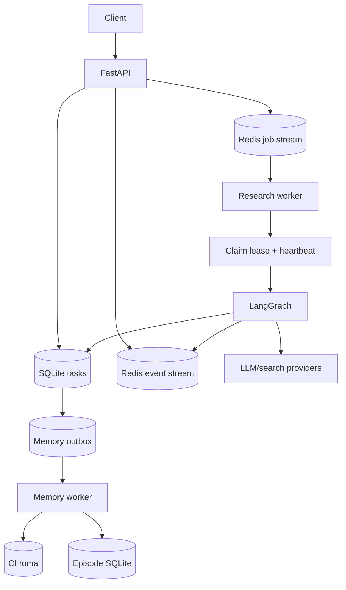
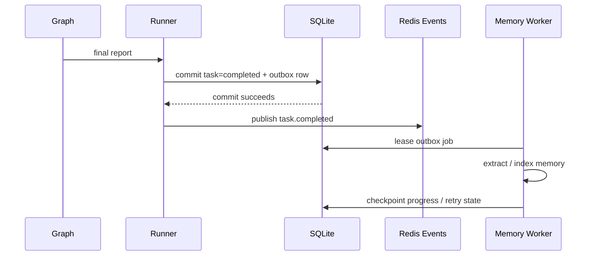

# System architecture

This document describes the current code boundaries, not an aspirational diagram.

## 1. Runtime ownership



**API owns commands and queries. Worker owns execution.** The API does not build
or drive the LangGraph. This removes request-process lifetime from the correctness
boundary of a long-running research task.

## 2. Research graph

`deep_research/agent_builder.py` composes the top-level graph. The Supervisor is
itself a research subgraph.

Core stages:

1. Build a research brief, optionally recalling historical context.
2. Produce a draft and dispatch research. A speculative mode can fan these out.
3. Pause at HITL review when enabled.
4. Run Supervisor/Researcher work with stage-aware memory hints.
5. Extract and verify claims from the draft.
6. Build a bounded writer context and stream the final report.
7. Persist the final report as task truth.
8. Enqueue durable memory enrichment in the same task-finalization transaction.

The graph uses research-generation fencing when speculative research is enabled so
a rejected generation cannot leak into a later accepted report.

## 3. Failure recovery

`backend/worker.py` and `backend/runtime/` implement three distinct recovery
mechanisms:

- **Redis consumer-group pending entries** preserve unacknowledged work.
- **Fenced task claims + heartbeat** prevent two workers from finalizing the same
  execution concurrently.
- **Persistent LangGraph checkpoints** allow a new worker to resume rather than
  restarting every model call.

Orphan reconciliation covers tasks that are non-terminal but temporarily have
neither a valid claim nor a queued job.

## 4. Completion boundary

A final report is business truth; memory is derived data.



If the atomic task/outbox commit fails, completion is not published and the Redis
job stays pending for reclaim. If memory enrichment fails later, the task remains
completed and the outbox retries independently.

## 5. Dependency direction

```text
backend (service/runtime) -------> deep_research (engine/domain)
       |                                  |
       |                                  +--> memory contracts
       +------> memory outbox ------------+
```

Shared process-local memory clients are created by
`deep_research/memory/runtime.py`. This prevents the memory layer from importing
`agent_builder.py` simply to obtain a global singleton.

## 6. Persistence map

| Store | Purpose | Source of truth? |
|---|---|---|
| SQLite task DB | task state, reports, review decisions, memory outbox, temporal audit | Yes for task lifecycle and temporal review |
| Redis | jobs, claims, events, LangGraph checkpoints | Runtime coordination |
| Chroma | report/section vectors and structured-memory indexes | Derived/searchable memory |
| Episodic SQLite | bounded observed research traces | Derived memory |
| JSONL artifacts | profiling / cost / reliability observations | Observability only |

## 7. What is deliberately not hidden

- Memory enrichment is at-least-once, not distributed exactly-once.
- Historical memory is not current evidence.
- Temporal "possible change" records are candidates; explicit review creates the
  authoritative decision.
- The repository does not currently provide tenant-isolated memory.